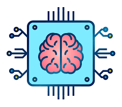

<h1 align="center"> 
  
  Hi, I'm Nikita Patidar 
</h1>

<h3 align="center">🚀 Data Scientist | Machine Learning | Generative AI Enthusiast</h3>

<!-- Typing Animation -->

 
  

---

## 👋 About Me

  

- 👀 **I’m passionate about**: Generative AI, Deep Learning, NLP, and Data Science  
- 🌱 **I’m currently learning**: Agentic AI , LLM fine-tuning, MLOps, AI model deployment  
- 💞️ **I’m looking to collaborate on**: AI-driven solutions, ML projects, and open-source contributions  
- 📫 **How to reach me**: [LinkedIn](https://www.linkedin.com/in/nikita-patidar-70a46a205/) | [Email](mailto:nikitapatidar957@gmail.com)  
- ⚡ **Fun fact**: I love breaking down complex AI topics into simple insights!

---

## 🚀 Tech Stack

  <!-- Skillicons (only supported icons) -->
  

  <!-- Custom icons (not supported by skillicons.dev) -->

---

## 🌱 Currently Exploring

  
  
  

- 📊 **Interpretable AI & Explainable Machine Learning**
- 🌍 **Deep Learning and NLP**
- 🏗️ **Gen AI and Agentic AI**
- 🔥 **Fine-tuning Large Language Models (LLMs)**

---

## 🔗 Connect with Me

   
  

---

## 📊 GitHub Stats

   
  

  

---

## 🏆 GitHub Achievements

 
  

---

## 🖥️ Latest AI & ML Projects

### 1. 🤖 **LLM-Based Chatbot** (Python, OpenAI API)
- Fine-tuned GPT for personalized responses.

### 2. 📉 **Stock Price Prediction** (Time Series, LSTM, TensorFlow)
- Deep Learning for financial forecasting using LSTM models.

### 3. 🧠 **AI-Powered Resume Screener** (NLP, Transformers)
- Automated resume ranking system using NLP and transformers.

### 4. 🔎 **Fake News Detection** (NLP, BERT)
- Text classification using BERT to detect fake news.

---

✨ **Designed & Built with ❤️ by Nikita Patidar** ✨
